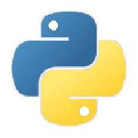
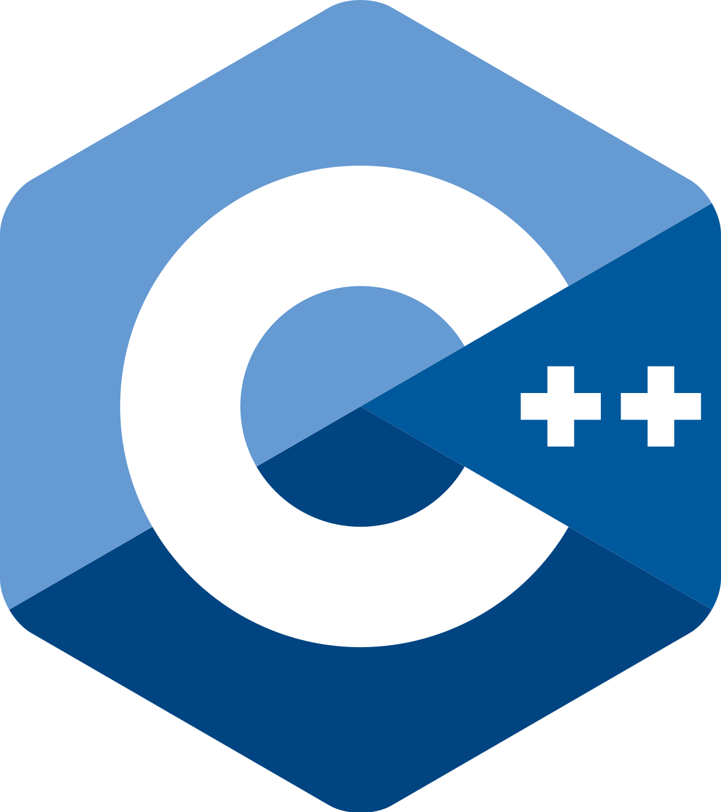

# Personal Info
Hi! I'm Diego Clavero, a solo dev and occasional game dev.

I have been programming since I was four-five years old, so I could say I have some experience.

Spain is an beautiful country, you should definitely come visit me!  

**README under construction, please forgive any incompleteness.**

# Knowledge
I have learned several languages over the years:
- Python 
- C/C++ 
- Java 
- JS 

# To-do list
Although I have completed most of my objectives, some are left to do, such as:

- Languages:
    - [ ] HTLM & CSS **(Very important)**
    - [ ] Kotlin
- [ ] End this list

New things will be added with the years, to hopefully end up completing them.

# Closing regards
It would be great if you took a look around <a href="https://diegoclavero.github.io">my webpage</a>, but it's up to you.

I haven't got much else to say, thanks for looking around my profile. Take care! 😊
